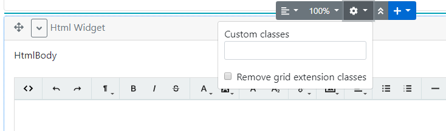

# Lombiq Helpful Extensions for Orchard Core

*NOTE*: This code was copied in this repository until OC hits a stable version.
This was copied from commit https://github.com/Lombiq/Helpful-Extensions/tree/f8163b8445c12beab095550480173504258bb222

## About

Orchard Core module containing some handy extensions (e.g. filters for Projector). Note that this module has a more recent version targeting the nightly build of Orchard in the [orchard-core-preview branch](https://github.com/Lombiq/Helpful-Extensions/tree/orchard-core-preview), as well as an Orchard 1 version in the [dev-orchard-1 branch](https://github.com/Lombiq/Helpful-Extensions/tree/dev-orchard-1).

## Extensions

The module consists of the following independent extensions (all in their own features):

### Code Generation Helpful Extensions

#### Content definition code generation
Generates migration code from content definitions. You can use this to create (or edit) a content type on the admin and then move its creation to a migration class. Generated migration code is displayed under the content types' editors, just enable the feature. Check out [this demo video](https://www.youtube.com/watch?v=KOlsLaIzgm8) to see this in action.

### Flows Helpful Extensions

Adds additional styling capabilities to the OrchardCore.Flows feature by making it possible to add classes to widgets in the Flow Part editor.

### Helpful Widgets

Adds multiple helpful widget content types. These are basic widgets that are added by built-in Orchard Core recipes though in case of using a custom setup recipe these can be added by this feature too.

Includes:

- ContainerWidget: Works as a container for further widgets. It has a FlowPart attached to it so it can contain additional widgets as well.
- HtmlWidget: Adds HTML editing and displaying capabilities using a WYSIWYG editor. 
- LiquidWidget: Adds Liquid code editing and rendering capabilities.

### Helpful Content Types

Includes basic content types that are added by built-in Orchard Core recipes though in case of using a custom setup recipe these can be added by this feature too.

Includes:

- Page: Highly customizable page content type with FlowPart and AutoroutePart.

The module's source is available in two public source repositories, automatically mirrored in both directions with [Git-hg Mirror](https://githgmirror.com):

- [https://bitbucket.org/Lombiq/helpful-extensions](https://bitbucket.org/Lombiq/helpful-extensions) (Mercurial repository)
- [https://github.com/Lombiq/Helpful-Extensions](https://github.com/Lombiq/Helpful-Extensions) (Git repository)

## Contributing and support

Bug reports, feature requests, comments, questions, code contributions, and love letters are warmly welcome, please do so via GitHub issues and pull requests. Please adhere to our [open-source guidelines](https://lombiq.com/open-source-guidelines) while doing so.

This project is developed by [Lombiq Technologies](https://lombiq.com/). Commercial-grade support is available through Lombiq.
